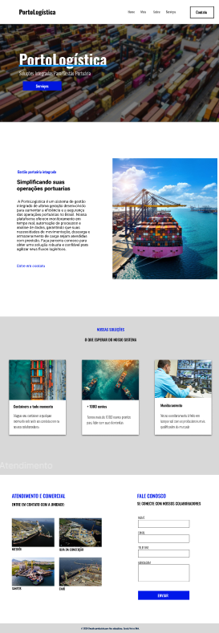

# Projeto de Interface Responsiva - Logística Portuária

Este repositório contém a implementação de uma página web responsiva para um projeto de logística portuária, com o objetivo de simular o layout fornecido no Figma de forma fiel, utilizando boas práticas de design e desenvolvimento web.

## 🎯 **Objetivo do Projeto**

O desafio consiste em criar uma interface responsiva que se adapte a diferentes tamanhos de tela, aplicando técnicas modernas de design e desenvolvimento. O layout deve ser estruturado e funcional, garantindo uma boa experiência para o usuário.

---

## 📋 **Requisitos Técnicos**

### Implementações realizadas:

1. **Unidades de Medida Relativas**:

   - Foram utilizadas unidades como `vw` (largura da viewport), `vh` (altura da viewport) e `em` para garantir que o layout seja dinâmico e responsivo.

2. **Estrutura com Flexbox**:

   - O layout foi organizado utilizando o **Flexbox**, proporcionando alinhamento e distribuição eficiente dos elementos em diferentes resoluções de tela.

3. **Tags de Formulário**:

   - Foram implementadas tags como:
     - `<form>`: Para criar um formulário funcional.
     - `<input>`: Para campos de entrada de dados.
     - `<textarea>`: Para campos de texto.

4. **Imagem de Fundo**:

   - A propriedade CSS `background-image` foi utilizada para adicionar imagens de fundo e melhorar a estética da página.

5. **Uso de Tags Semânticas**:
   - Foram usadas tags semânticas como `<header>`, `<main>`, `<footer>`, `<section>`, e outras para estruturar o conteúdo de maneira organizada e acessível.

---

## 💡 **Diferenciais**

- **Responsividade:** A página foi projetada para funcionar perfeitamente em diferentes dispositivos, como desktops, tablets e smartphones.
- **Acessibilidade:** O uso de tags semânticas melhora a acessibilidade, facilitando a leitura por ferramentas como leitores de tela.
- **Design Modular:** O uso do Flexbox permite uma adaptação natural do layout, sem quebra de elementos.

---

## 🚀 **Tecnologias Utilizadas**

- **HTML5**: Para a estrutura da página e marcação semântica.
- **CSS3**: Para estilização, incluindo o uso de Flexbox, imagens de fundo e unidades de medida relativas.

---

## 🖼️ **Preview do Projeto**

Confira abaixo uma visão geral da interface implementada:



---

## 🛠️ **Como Executar o Projeto**

1. Clone este repositório:
   ```bash
   git clone https://github.com/seu-usuario/projeto-logistica-portuaria.git
   ```
2. Navegue até o diretório do projeto:
   ```bash
   cd projeto-logistica-portuaria
   ```
3. Abra o arquivo index.html em seu navegador.

---
